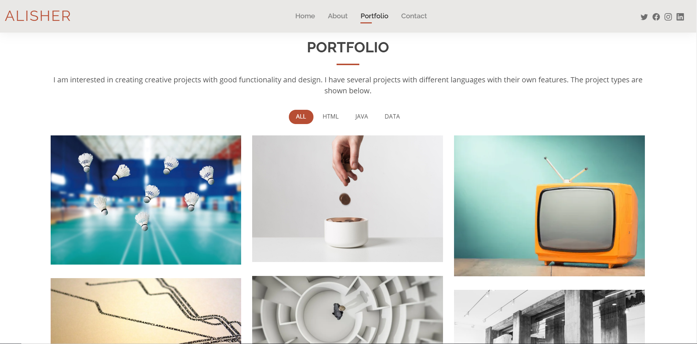

## About Project

This is my project about CV portfolio Website, where you can introduce interesting information about myself. Website has several pages and each page has your own inforamation, so there we have pages like: Home, About, Portfolio, Contact. There we can change pages using ROUTES, and control it inside web.php

## First page - HOME
  This is my first page.
   

## SECOND PAGE - ABOUT
This is my second page.

About me.

### SECOND PAGE - SKILL

About skills.

## THIRD PAGE - PORTFOLIO
This is my third page about my work.

## FOURTH PAGE - CONTACT

Last page to Contact to me.

